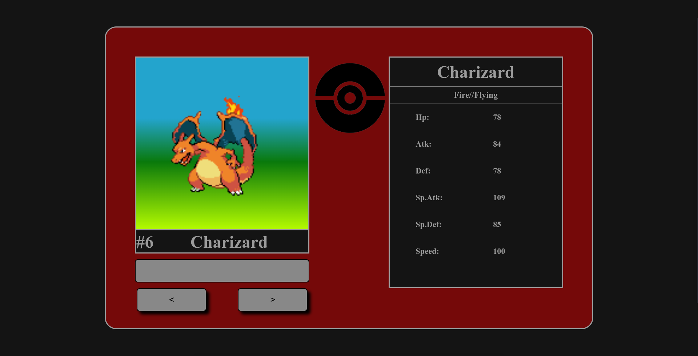
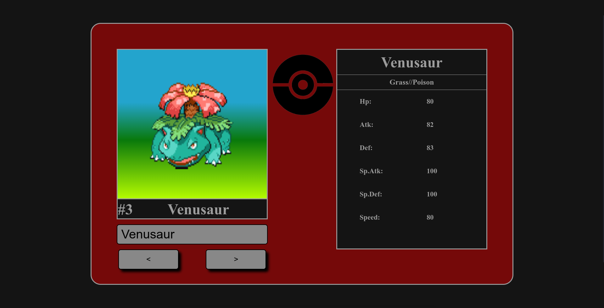
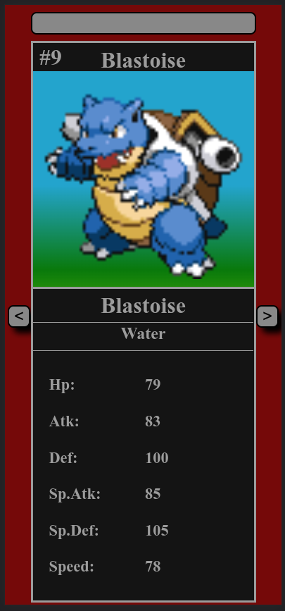

# Minimal Pokedex by pokeapi

## Summary

- Project
- Git Clone
- Objetive
- Search Forms
- Responsiveness
- More About PokéAPI

## Project

The project is a pokedex created for the web using an API called PokéAPI, using only HTML CSS and JavaScript.

> link to project https://minimalpokedexpokeapi.netlify.app

## Git Clone

```sh
> git clone https://github.com/cleytonmanoel/Minimal-dex-pokeapi.git
```

## Objetive

The aim of the project is to create a web pokedex with minimal functions related to pokemons (name, pokedex number and status).

## Search Forms

### The project has three forms for search pokemons.

- the first is by buttons in pokedex.
- the second is writing the name for pokemon in search bar.
- the third is writing the pokedex number of the pokemon.

<div align="center">





</div>

## Responsiveness

The project is far from being an example of responsiveness, it is just responsive enough to show all the necessary information on mobile devices.

<div align="center">

</div>

## More About PokéAPI

PokéAPI is a full RESTful API linked to an extensive database detailing everything about the Pokémon main game series.

For more information about PokéAPI, check out the official api website.

> official website https://pokeapi.co

> official repositores https://github.com/PokeAPI
